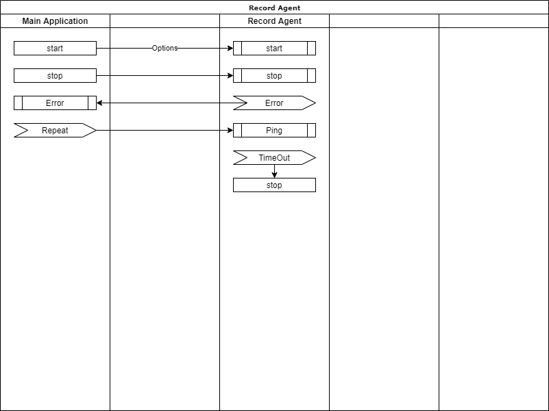

# Record Agent - 녹화 에이전트 통신

* Repeat --> Ping
  * 처음에는 메인 프로그램이 오류로 인해서 종료되는 경우를 파악하기 위해서 메인 프로그램의 핸들을 계속 조사하는 것 고려했으나 응답 없음으로 빠지는 경우에는 문제가 발생 할 수 있다.
  * 메인 프로그램에서 주기적으로 Ping 메시지를 날리면 녹화 에이전트는 Ping 일정 시간 날아오지 않은 경우에는 문제가 있다고 간주하고 진행 중인 녹화를 중단한다.