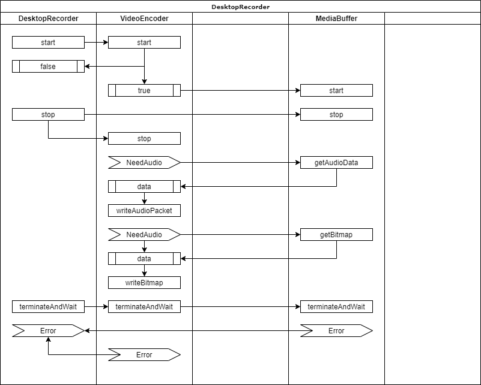
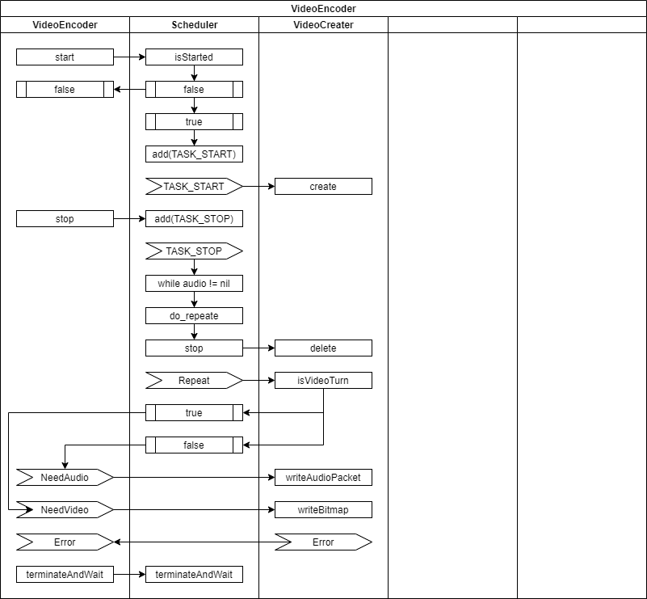
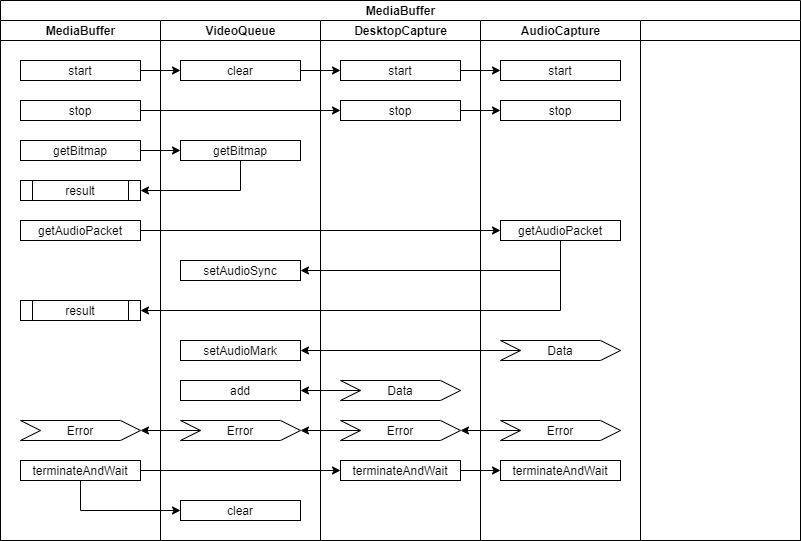

# Desktop Recorder -화면 녹화 모듈

## DesktopRecorder class

* 2020.06.26 변경사항
  * 기존의 설계에서 Scheduler를 없애고 동기식으로 진행되는 Start, Stop 등의 메시지를 비동기로 처리합니다.
    * VideoEncoder와 MediaBuffer가 내부에 각자 스레드를 가지고 비동기식으로 작동합니다.
  * start() 메시지는 이전 인코딩 동작이 아직 진행 중이면 false를 리턴하고 MediaBuffer는 시작하지 않습니다.
  * stop() 메시지는 MediaBuffer를 바로 중지하여 추가적인 캡쳐가 일어나지 않도록 하고 VideoEncoder는 MediaBuffer가 비워질 때까지 남은 패킷을 모두 처리하고 종료합니다.

## VideoEncoder class

* while audio != nil
  * 오디오 버퍼가 빌 때까지 Repeat 이벤트를 발생시킵니다.
  * 비디오(화면)는 오디오 기준으로 싱크를 할 예정이기 때문에 오디오에 맞춰서 가져오기만 하면 됩니다.

## MediaBuffer class

* setAudioMark
  * 오디오가 발생할 때마다 오디오 기준의 시간을 VideoQueue 버퍼에 설정합니다.
  * VideoQueue에 저장되는 패킷들은 오디오 기준 시간이 새겨집니다.
* setAudioSync
  * 현재 오디오가 어디까지 인출되었는지를 알려줍니다.
  * 비디오 패킷은 자신에게 새겨진 시간과 오디오 진행 히간을 비교해서 이전 패킷들만 내보냅니다.
