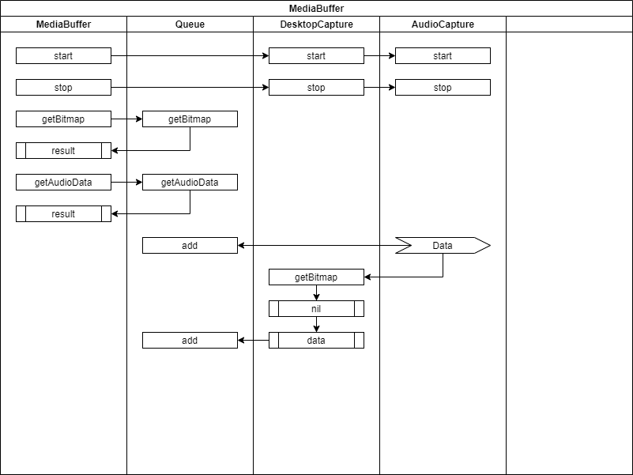

# MediaBuffer - 오디오 화면 싱크 모듈

* 오디오 데이터가 발생하면 DesktopRecorder에 새로운 화면 캡쳐를 요구한다.
* 오디오 발생 주기는 일반적으로 빠르기 때문에 초당 프레임 수보다 일찍 화면 캡쳐를 요구한 경우에는 무시하고 nil을 반환한다.
* 오디오 데이터는 발생하면 바로 큐에 넣는다.
* 화면 캡쳐는 nil이 아닌 경우에만 큐에 넣는다.
* 큐에 화면 캡쳐가 밀리면 이미지를 압축하여 디스크에 저장하는 기능을 구현한다.