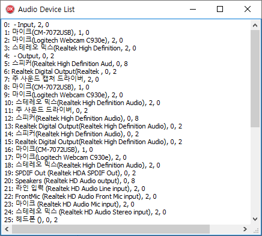
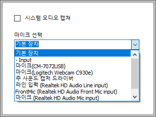

# AudioDevice.dll 사용법

최초 미팅에서는 dll로 모듈을 제공하는 개발으로 진행되었으나, 
이후 소스 보호 문제로 인해서 별도의 프로세스에서 동작하는 어플리케이션으로 변경되어
오디오 장치 목록을 표시하고 선별하여 캡쳐할 수 있도록 별도의 dll 모듈을 작성하였습니다.


이 모듈은 소스를 제공할 필요 없는 오픈소스를 사용하였습니다.


## 바이너리 파일

* [바이너리 파일 다운로드 - AudioDevice.dll.zip](/downloads/AudioDevice.dll.zip)
* 파일 구성
  * portaudio.dll: 오픈소스 오디오 라이브러리 portaudio의 dll 파일
  * AudioDevice.dll: portaudio를 이용하여 작성한 오디오 디바이스 목록 및 정보 가져오기 라이브러리
  * test_AudioDevice.exe: 델파이로 작성한 AudioDevice.dll 테스트 프로그램 (모든 파일이 같은 폴더에 있어야 함)


## test_AudioDevice.exe 실행결과


* 디바이스가 중복으로 등록되어서 반복되는 경우가 있습니다. 이름이 중복되면 첫 번 째 장치 이후는 무시하셔도 됩니다.
* 메인 프로그램에서 녹화 에이전트에 녹화 신호를 보낼 때, 캡쳐할 화면 영역 등의 정보와 함께 캡쳐할 오디오 장치의 아이디를 넘겨주셔야 합니다.
  * 맨 앞의 숫자가 장치 아이디입니다.
  * 오디오 채널은 두 개로 개발할 예정입니다. 스테레오 믹스와 마이크의 장치 아이디를 녹화 에이전트에 넘겨주시면 됩니다.


## 중복 장치를 제거하고 입력장치 목록만 가져온 결과

* "사용의 예 #2 - Delphi" 참고
* 같은 장치인데 중간에 띄어쓰기(공백)만 다른 경우도 있습니다.
* @가 들어간 경우는 제외 시켰습니다. PortAudio는 있는 그대로 장치를 스캔해 오는데 @가 붙은 것들은 굳이 필요 없어 보여서 임의로 삭제한 것입니다.
* "- Input"의 경우는 기본 장치를 뜻하는 것 같은데 혹시 몰라서 그대로 두었습니다.


## AudioDevice.dll의 인터페이스

``` cpp
// AudioDevice.dll를 사용하기 전에 무조건 한번은 실행해야 합니다. 라이브러리를 초기화 합니다.
extern "C" __declspec(dllexport) int initAudioDevice()

// 호스트 PC에 설치되어 있는 오디오 장치의 개수를 리턴합니다.
extern "C" __declspec(dllexport) int getDeviceCount()

// 목록에서 index에 해당하는 순서의 장치 이름을 가져옵니다.
extern "C" __declspec(dllexport) void getDeviceName(int index, char* name, int size)

// 목록에서 index에 해당하는 순서의 장치의 입력 채널 수를 리턴합니다. 0보다 크면 입력장치입니다.
extern "C" __declspec(dllexport) int getInputChannels(int index)

// 목록에서 index에 해당하는 순서의 장치의 출력 채널 수를 리턴합니다. 0보다 크면 출력장치입니다.
extern "C" __declspec(dllexport) int getOutputChannels(int index)
```


## 사용의 예 #1 - C++

``` cpp
main()
{
    char name[256];

    initAudioDevice();
    for (int i=0; i<getDeviceCount(); i++) {
        getDeviceName(i, name, sizeof(name));
        printf("%d: %s, %d, %d \n", i, name, getInputChannels(i), getOutputChannels(i));
    }
}
```


## 사용의 예 #2 - Delphi

``` pascal
// 이름 속의 공백문자열을 제거하여 비교할 수 있도록 한다.
function delete_whitespace(const text:string):string;
var
  i: Integer;
begin
  Result := '';
  for i := 1 to Length(text) do
    if text[i] <> ' ' then Result := Result + text[i];
end;

// 이미 등록된 장치인지 알려준다.
function is_device_in_the_list(list:TStrings; name:string):boolean;
var
  i: Integer;
begin
  Result := false;

  name := delete_whitespace(name);
  for i := 0 to list.Count-1 do
    if name = delete_whitespace(list[i]) then begin
      Result := true;
      Exit;
    end;
end;

// C 스타일 문자열을 델파이 문자열로 변경한다.
function GetAudioDeviceName(index:integer):string;
var
  text : PAnsiChar;
  buffer : array [0..1024] of byte;
begin
  text := @Buffer;
  getDeviceName(index, text, SizeOf(buffer));
  Result := StrPas(text);
end;

procedure TfrMic.cbMicDropDown(Sender: TObject);
var
  i: Integer;
  device_name : string;
begin
  cbMic.Items.Clear;
  cbMic.Items.AddObject('기본 장치', TObject(-1));

  initAudioDevice;
  for i := 0 to getDeviceCount-1 do begin
    device_name := Trim(GetAudioDeviceName(i));

    if getInputChannels(i) = 0 then Continue;
    if is_device_in_the_list(cbMic.Items, device_name) then Continue;
    if Pos('@', device_name) > 0 then Continue;

    // 장치 순번(아이디)를 함께 저장해서 선택된 장치의 아이디를 알 수 있도록 한다.
    cbMic.Items.AddObject(device_name, TObject(i));
  end;
end;
```