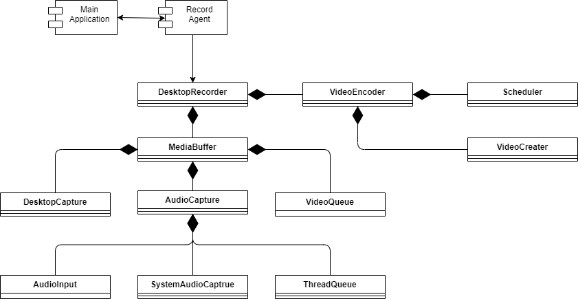

# 시스템 구조

* DesktopRecorder: 화면 녹화의 메인 클래스
  * VideoEncoder
    * Scheduler
      * 별도의 스레드로 프로세스를 진행하여 UI와 비동기로 처리된다.
      * 외부의 요청과 내부의 반복처리가 단일 스레드로 이루어져 임계영역 없이 동기화되는 이점이 있다.
    * VideoCreater
      * 화면의 스크린샷과 오디오 패킷을 압축하고 mp4로 저장한다.
  * MediaBuffer: 오디오와 화면 캡쳐가 순서대로 싱크를 맞춰서 보관되는 버퍼
    * DesktopCapture
      * 지정된 영역의 화면을 캡쳐한다.
    * AudioCapture
      * AudioInput
        * 기본으로 설정된 오디오 장치에서 오디오를 캡쳐한다.
      * SystemAudioCaptrue
        * 시스템 오디오를 캡쳐한다.
      * ThreadQueue
        * 기본 오디오와 시스템 오디오를 섞어서 보관한다.
    * VideoQueue
      * 오디오 싱크에 맞춰서 비디오를 저장한다.
      * 메모리를 너무 많이 차지하면 디스크에 저장하여 메모리 부담을 줄인다.